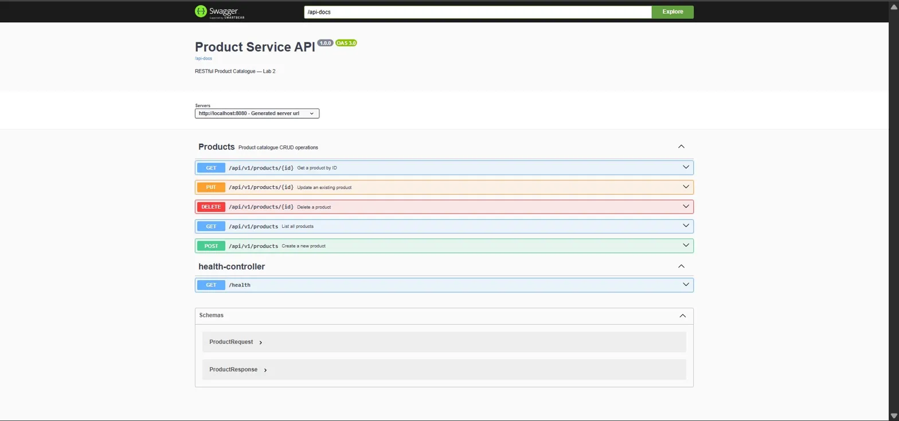

# Product Service API

## Overview

A production-grade RESTful Product Catalogue API developed as part of the CTBE Software Engineering
Enterprise Application Development module. Built with Spring Boot 3 and Java 21, the service
implements full CRUD operations, Bean Validation, RFC 9457-compliant error responses,
OpenAPI/Swagger documentation, and a comprehensive MockMvc integration test suite — all
verified by a green GitHub Actions CI pipeline.

---

## Technology Stack

| Technology | Version |
|---|---|
| Java | 21 |
| Spring Boot | 3.3.5 |
| Spring Data JPA | 3.3.5 |
| H2 In-Memory Database | Runtime |
| SpringDoc OpenAPI (Swagger) | 2.3.0 |
| JUnit 5 + MockMvc | 3.3.5 |
| Maven | 3.x |

---

## Getting Started

### Prerequisites
- Java 21 or higher
- Maven 3.x

### Run the Application

    mvn spring-boot:run

The application starts on port **8080** and seeds the database with three sample products automatically.

### Run Tests

    mvn test

Expected result: **10 tests, 0 failures, BUILD SUCCESS**

---

## API Endpoints

Base URL: `http://localhost:8080/api/v1/products`

| Method | Path | Status | Description |
|--------|------|--------|-------------|
| GET | `/api/v1/products` | 200 OK | Returns a list of all products |
| GET | `/api/v1/products/{id}` | 200 OK / 404 Not Found | Returns a single product by ID |
| POST | `/api/v1/products` | 201 Created | Creates a new product |
| PUT | `/api/v1/products/{id}` | 200 OK / 404 Not Found | Fully updates an existing product |
| DELETE | `/api/v1/products/{id}` | 204 No Content / 404 Not Found | Deletes a product |

### Sample Request — POST /api/v1/products

    {
      "name": "Webcam",
      "price": 99.99,
      "stockQty": 20,
      "category": "Peripherals"
    }

### Sample Response — 201 Created

    {
      "id": 4,
      "name": "Webcam",
      "price": 99.99,
      "stockQty": 20,
      "category": "Peripherals"
    }

### Error Response — 404 Not Found (RFC 9457)

    {
      "type": "https://api.example.com/errors/not-found",
      "title": "Resource Not Found",
      "status": 404,
      "detail": "Product 99 not found"
    }

### Error Response — 400 Bad Request (RFC 9457)

    {
      "type": "https://api.example.com/errors/validation",
      "title": "Validation Error",
      "status": 400,
      "detail": "Name is required"
    }

---

## Swagger UI

Interactive API documentation is available once the application is running:

- **Swagger UI:** http://localhost:8080/swagger-ui.html
- **OpenAPI JSON spec:** http://localhost:8080/api-docs

---

## Project Structure

    src/
    ├── main/java/com/ctbe/yeabsirasamuel/productservice/
    │   ├── controller/        # ProductController — HTTP layer
    │   ├── service/           # ProductService — business logic
    │   ├── repository/        # ProductRepository — data access
    │   ├── model/             # Product — JPA entity
    │   ├── dto/               # ProductRequest, ProductResponse — DTOs
    │   ├── exception/         # ResourceNotFoundException, GlobalExceptionHandler
    │   └── ProductServiceApplication.java
    └── test/java/com/ctbe/yeabsirasamuel/productservice/
        └── ProductControllerTest.java  # 8 MockMvc integration tests

---

## Postman Collection

A ready-to-import Postman collection covering all endpoints is located at:

    postman/product-service-lab2.json

Import it into Postman via **File → Import** to test all endpoints immediately.

---

## Author

Yeabsira Samuel — CTBE Software Engineering, Enterprise Application Development